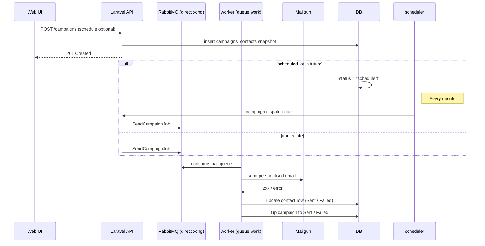

# React + Laravel Starter Template

This repository provides a batteries‑included full‑stack scaffold with **Laravel 12** for the backend and **React 18 (TypeScript + Vite)** for the frontend.

---

## Features

* 🚀 Laravel API‑only backend with Sanctum / Fortify auth
* ⚛️ React SPA served by Vite
* 🐳 Docker Compose for reproducible, containerised dev
* 📧 Email campaign engine with per‑recipient merge, RabbitMQ queue, Mailgun delivery
* 🔑 Mailhog pre‑wired for local email inspection

---

## Getting Started

### 1 — Spin up the backend stack

```bash
# At repository root
docker compose up -d            # app, db, rabbitmq, mailhog, worker, scheduler, …
```

* **app** – PHP‑FPM + CLI
* **worker** – long‑running queue consumer (`queue:work`)
* **scheduler** – Laravel’s scheduler loop (`schedule:work`)
* **rabbitmq** – AMQP broker & management UI ([http://localhost:15672](http://localhost:15672))
* **mailhog** – SMTP sink & web UI ([http://localhost:8025](http://localhost:8025))

### 2 — Start the React dev server

```bash
cd react-frontend
npm install
npm run dev       # Vite will print the local URL, e.g. http://localhost:5173
```

---

## Email Campaign System

### High‑level flow



### Containers

| Container     | Purpose                                                                        | Default command                                               |
| ------------- | ------------------------------------------------------------------------------ | ------------------------------------------------------------- |
| **worker**    | Consumes the `mail` queue and executes `SendCampaignJob`                       | `php artisan queue:work rabbitmq --queue=mail --tries=3`      |
| **scheduler** | Runs Laravel’s scheduler loop, waking once per minute to enqueue due campaigns | `php artisan schedule:work --verbose --ansi --no-interaction` |

### Environment variables

Add these to `.env` (already present in `docker-compose.yml`):

```env
QUEUE_CONNECTION=rabbitmq
RABBITMQ_HOST=rabbitmq
RABBITMQ_QUEUE=mail
MAILGUN_SECRET=key-xxxxxxxxxxxxxxxxxxxxx
MAILGUN_DOMAIN=news.customer.com
```

### Queue connection (`config/queue.php`)

Make sure the RabbitMQ connection uses a **direct** exchange (no plugins required):

```php
'connections' => [
    'rabbitmq' => [
        'driver'       => 'rabbitmq',
        'queue'        => env('RABBITMQ_QUEUE', 'mail'),
        'exchange'     => env('RABBITMQ_EXCHANGE', 'laravel'),
        'exchange_type'=> 'direct',
        // …hosts array…
    ],
],
```

### Scheduler registration (Laravel 11/12 style)

Edit `bootstrap/app.php`:

```php
use Illuminate\Console\Scheduling\Schedule;
use App\Console\Commands\DispatchDueCampaigns;

return Application::configure(basePath: dirname(__DIR__))
    // …other builder calls…
    ->withCommands([
        DispatchDueCampaigns::class,
    ])
    ->withSchedule(function (Schedule $schedule) {
        $schedule->command('campaign:dispatch-due --chunk=200')->everyMinute();
    })
    ->create();
```

### Turning the scheduler on/off

* **Stop / start container**

  ```bash
  docker compose stop scheduler   # pause
  docker compose start scheduler  # resume
  ```
* **Scale to zero**

  ```bash
  docker compose up -d --scale scheduler=0   # remove
  docker compose up -d --scale scheduler=1   # add back
  ```
* **Env flag** – wrap in `when()`:

  ```php
  ->when(env('ENABLE_SCHEDULER', true), function ($app) {
      $app->withSchedule(fn (Schedule $s) =>
          $s->command('campaign:dispatch-due --chunk=200')->everyMinute());
  })
  ```

  Then toggle `ENABLE_SCHEDULER=false` in `.env`.

### Manual commands

| Purpose                        | Command                                        |
| ------------------------------ | ---------------------------------------------- |
| Run scheduled tasks now        | `php artisan schedule:run`                     |
| Wake due campaigns immediately | `php artisan campaign:dispatch-due`            |
| Start a local queue worker     | `php artisan queue:work rabbitmq --queue=mail` |

---

## Mailhog

Mailhog captures all outbound mail in **dev**.

* Web UI: [http://localhost:8025](http://localhost:8025)
* SMTP: `mailhog:1025`

---

## RabbitMQ

* Web console: [http://localhost:15672](http://localhost:15672) (guest / guest)
* The **mail** queue appears as soon as a `SendCampaignJob` is published.

---

Happy hacking! 🎉
